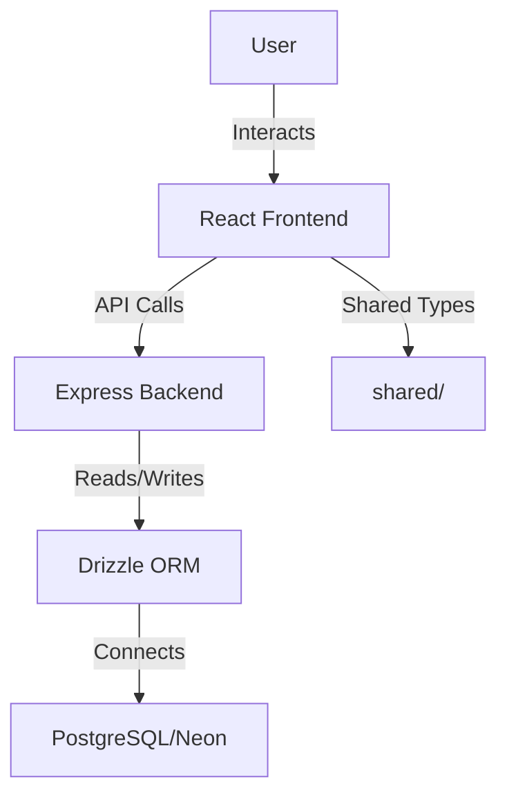

# Tool Justification & Implementation

## Overview
This document details the rationale behind each major technology, library, and tool used in the Checkers Analysis Tool, along with implementation notes and configuration highlights. The goal is to provide transparency for future maintainers and justify architectural decisions.

---

## Frontend

### React 18 + TypeScript
- **Why:** Modern, component-based UI development with strong typing for maintainability and safety.
- **How:** All UI logic and rendering are implemented as React function components in TypeScript. State is managed via hooks, and props are strictly typed.
- **Example:**
  ```tsx
  // src/pages/checkers.tsx
  export default function CheckersPage() {
    const [gameState, setGameState] = useState<GameState>(...);
    // ...
  }
  ```

### Vite
- **Why:** Lightning-fast development server, HMR, and optimized production builds.
- **How:** Used as the build tool for the frontend. Configured via `vite.config.ts` for custom aliases and plugin integration.
- **Example:**
  ```ts
  // vite.config.ts
  import { defineConfig } from 'vite';
  import react from '@vitejs/plugin-react';
  export default defineConfig({
    plugins: [react()],
    resolve: { alias: { '@': '/src' } },
  });
  ```

### shadcn/ui & Radix UI
- **Why:** Accessible, composable UI primitives with a modern look and feel.
- **How:** All interactive UI elements (buttons, dialogs, tooltips, etc.) are built using these libraries, ensuring accessibility and consistency.
- **Example:**
  ```tsx
  import { Button } from '@/components/ui/button';
  <Button onClick={...}>Analyze</Button>
  ```

### Tailwind CSS
- **Why:** Utility-first CSS for rapid prototyping and consistent styling.
- **How:** Used throughout all components for layout, spacing, and theming. Configured via `tailwind.config.ts`.
- **Example:**
  ```tsx
  <div className="container mx-auto p-4 max-w-7xl">...</div>
  ```

### TanStack Query (React Query)
- **Why:** Efficient server state management and caching for API calls.
- **How:** Used to fetch, cache, and update game state from the backend.
- **Example:**
  ```tsx
  import { useQuery } from '@tanstack/react-query';
  const { data } = useQuery(['game', id], fetchGame);
  ```

### Wouter
- **Why:** Lightweight, fast client-side routing.
- **How:** Used for page navigation and 404 handling.
- **Example:**
  ```tsx
  import { Switch, Route } from 'wouter';
  <Switch>
    <Route path="/" component={CheckersPage} />
    <Route component={NotFound} />
  </Switch>
  ```

---

## Backend

### Express.js
- **Why:** Minimal, flexible, and widely adopted Node.js web framework.
- **How:** Handles all REST API endpoints, error handling, and static file serving.
- **Example:**
  ```ts
  import express from 'express';
  const app = express();
  app.use(express.json());
  app.post('/api/games', ...);
  ```

### Drizzle ORM
- **Why:** Type-safe, modern ORM for PostgreSQL with migration support.
- **How:** Defines database schema, handles queries, and provides Zod integration for validation.
- **Example:**
  ```ts
  import { pgTable, text, serial, jsonb } from 'drizzle-orm/pg-core';
  export const games = pgTable('games', { ... });
  ```

### Neon Database (PostgreSQL)
- **Why:** Serverless, scalable PostgreSQL for production; currently using in-memory for dev.
- **How:** Connection string managed via environment variables. Migration path planned.

### Zod
- **Why:** Runtime schema validation for API safety and type inference.
- **How:** Used to validate incoming API requests and define shared types.
- **Example:**
  ```ts
  import { z } from 'zod';
  const insertGameSchema = z.object({ ... });
  ```

---

## Shared & Monorepo

### Shared Types
- **Why:** Ensures type safety and consistency between frontend and backend.
- **How:** Types and schemas are defined in `shared/` and imported everywhere.
- **Example:**
  ```ts
  // shared/schema.ts
  export type GameState = { ... };
  ```

---

## Build Tools & Utilities

### ESBuild
- **Why:** Fast, modern JavaScript/TypeScript bundler for backend production builds.
- **How:** Used in the `build` script to bundle the backend.
- **Example:**
  ```json
  "build": "vite build && esbuild server/index.ts --platform=node --packages=external --bundle --format=esm --outdir=dist"
  ```

### TSX
- **Why:** TypeScript execution in development for backend.
- **How:** Used in the `dev` script for hot-reloading backend development.

### Drizzle Kit
- **Why:** Database schema migration and management.
- **How:** Used for pushing schema changes to the database.
- **Example:**
  ```json
  "db:push": "drizzle-kit push"
  ```

---

## Testing Utilities

### Manual Testing
- **Why:** Ensures all user flows and edge cases are covered.
- **How:** Performed via interactive UI and API endpoint testing.

### Automated Testing (Planned)
- **Jest/React Testing Library:** For unit and integration tests (future roadmap).
- **Supertest:** For backend API endpoint testing (future roadmap).

---

## Architectural Diagram



---

## Summary Table

| Tool/Library         | Purpose                                 | Key Config/Usage Location         |
|---------------------|-----------------------------------------|-----------------------------------|
| React + TypeScript  | UI, state, type safety                  | client/src/                       |
| Vite                | Frontend build/dev server                | vite.config.ts                    |
| shadcn/ui, Radix UI | Accessible UI primitives                 | client/src/components/ui/         |
| Tailwind CSS        | Styling                                  | tailwind.config.ts, index.css     |
| TanStack Query      | Server state management                  | client/src/lib/queryClient.ts     |
| Wouter              | Routing                                  | client/src/App.tsx                |
| Express.js          | API server                               | server/index.ts                   |
| Drizzle ORM         | DB schema/queries                        | shared/schema.ts, server/storage.ts|
| Neon/PostgreSQL     | Database                                 | .env, drizzle.config.ts           |
| Zod                 | Validation, type inference               | shared/schema.ts                  |
| ESBuild, TSX        | Build/dev tooling                        | package.json                      |
| Drizzle Kit         | DB migrations                            | drizzle.config.ts                 | 